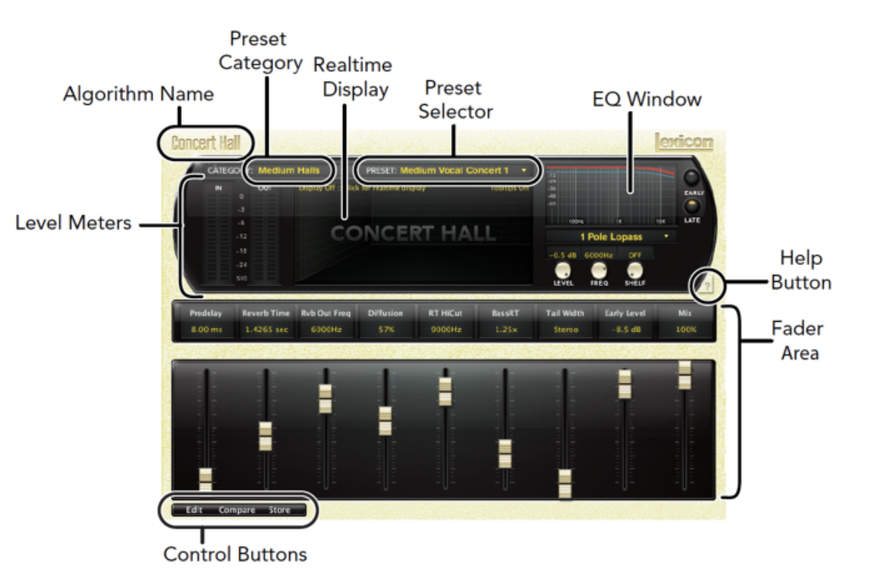

# Lexicon 리버브 사용법

## Lexicon 이란
회사 이름이기도하며 '디지털 리버브의 대가'로 알려져 있다. 
현재 Harman에 인수되어 여러 오디오 시스템을 개발하고 있다. 
1978년에 Lexicon 224로 전세대의 사운드에 다수 쓰이며 지금까지 만들어진 가장 보편적인 리버브가 되었다. 
이후에도 480L 등이 나오며 많은 스튜디오에서 아직도 현역으로 뛰는 중이라고... 
우리는 렉시콘에 PCM 컬렉션으로 QBase에서 활용할 것이다.

## Lexicon PCM 사용법
https://thenotemusic.tistory.com/965
 
https://thenotemusic.tistory.com/966
 위 메뉴얼 번역본을 내가 보기 쉽게 정리하였다.

### 공간 종류에 따른 플러그인 이름:
|**종류**            |**플러그인 이름**|
|:---:|:---|
|Chamber|LexChamber|
|Concert Hall|LexConcertHall|
|Plate|LexPlate|
|Room|LexRoom|
|Hall|LexHall|
|Random Hall|LexRandomHall|
|Vintage Plate|LexVintagePlate|

위 7개는 공간 종류에 따라 다른 알고리즘을 포함하고 있다. 

### PCM Reverb 개요
플러그인의 공통적인 부분 설명

1. Level Meters: 인풋과 아웃풋의 레벨을 보여줌
2. Algorithm Name: 플러그인 좌측 상단에 현재 선택된 플러그인의 알고리즘이 이름이 있음
3. Preset Category: 개별 알고리즘 별로 프리셋이 다시 그룹지어져 있음.  ex) Hall - Small Halls, Medium Halls 등 ※해당 영역 클릭 후 카테고리 선택가능
4. Realtime Display: 3가지 방법으로 리버브를 확인할 수 있다. 자세한 설명은 밑에 Display 파트에 있다.
5. Preset Selector : 옆에 선택한 카테고리의 프리셋을 볼 수 있다. 프리셋 선택시 불러와 진다.
6. EQ Window : 초기 반사음과 리버브 잔향에 적용할 수 있는 EQ필터 종류를 선택할 수 있다. 자세한 설명은 아래 EQ Window 파트에 있다.
7. Help Button : 도움말

