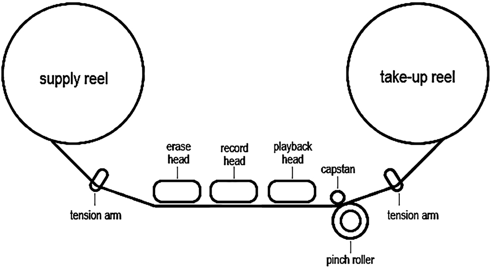

# 제11장 아날로그와 디지털 녹음 방식

## 1. 아날로그 오픈릴 녹음기
- 아날로그 녹음: **오디오 신호**가 **자기 신호**로 변환되어 **테이프에 영구 저장** 되는 방식
  - 일반적으로 **자기 테이프**는 얇은 플라스틱 위에 철이나 크롬, 그리고 메탈 입자들이 코팅되어 있다.
  - 이는 평소 불규칙하게 분산되어 있던 입자들이 오디오 신호가 전달되면서 **일관된 형태를 유지**(저장)하게 된다.

### 아날로그 오픈릴 녹음기(오디오 테이프 녹음기) 구성요소
- 테이프 운송 시스템(Tape Transport System)
- 자기 헤드(Magnetic Head)
- 전기 회로(Electronic Circuit)

### 테이프 운송 시스템

**운송 파트**는 테이프를 헤드에 밀착시키며 **테이프의 주행 속도와 장력을 일정하게 유지**하는데 기여하며 테이프를 빠르게 이동시키기도 함

3개의 모터가 있다. 이 중 2개는 장력과 흔들림을 방지한다. (may be..서플라이 릴과 테이크업 릴 구동..?) 
1개는 캡스턴을 가동시키는데 사용된다.

|이름            |설명|
|:---:|:---|
|**캡스턴(Capstan)**|운송시스템의 심장부, 테이프의 속도를 조절하는 정밀한 구동축이다.|
|**핀치 롤러(Pinch Roller)**|고무로 되어 있으며 테이프를 모터 구동축으로 미는 역활|
|**서플라이 릴(Supply Reel) 테이크-업 릴(Take-up Reel)**|서플라이 릴과 테이크-업 릴은 모터로 구동되며 공급 전류는 테이프가 늘어짐 없이 최상의 상태로 주행하도록 릴의 장력(tension)을 조정한다. 서플라이와 테이크-업 모터의 공급 전류는 릴의 회전을 일정하게 유지시킨다.|
|**릴 사이즈(Reel-Size)**|위의 두개의 릴은 릴의 회전을 일정하게 유지하지만 두 릴의 크기 차이로 인한 **장력변화**를 조절하지 못하기 때문에 녹음기의 Tension 혹은 **Reel-Size 스위치**는 릴 크기로 인한 장력 변화를 일정하게 유지한다.|
|**안전 조정**|테이프의 손상을 방지하기 위해 테이프 가이드 통로에 테이프의 유무를 확인하는 감지 장치이다.|
|**가이드 롤러(Guide Roller)**|테이프가 헤드와 릴 위에서 올바르게 주행하도록 가이드한다.|
|**테이프 주행속도(Tape Speed)**|아날로그 테이프는 주행 속도가 빠를수록 음질이 개성되며 종류로는 17/8, 33/4, 7/12, 15 그리고 30ips 등이 있다.|
|**헤드 블록(Head Block)**|녹음기 헤드 블록은 소거(Erase), 녹음(Record) 그리고 재생(Reprodece) 헤드로 구성된다. 소거 헤드 : 테이프에 저장된 신호를 지운다. 녹음 헤드 : 전기 신호를 자기 신호로 전환한다. 재생 헤드 : 녹음헤드에서 전환된 자기 신호를 다시 전기 신호로 전환시킨다. 모든 헤드와 체이프는 닿는 면이 정확하게 90º가 되어야 고음손실을 방지할 수 있다. 이 때 테이프와 헤드와 각도를 조정하는 것을 애지머스 조정(Azimuth Alignment)이라고 한다.|

### 전기 회로

전기 회로는 **오디오 신호의 주파수 응답과 레벨을 조정**하여 녹음 헤드에 공급하고 **테이프 자기 특성**에 따라 **재생 헤드 신호의 주파수 응답과 레벨을 조정**